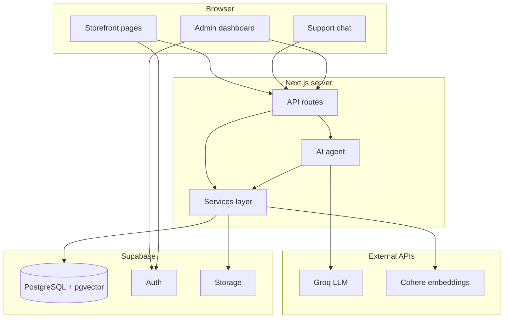

# Lumière Bridal — AI Customer Support Demo

A full-stack e-commerce demo for a fictional bridal brand. Customers can shop, checkout, and chat with an AI support agent. Admins manage products, orders, knowledge, and conversations from a dashboard.

The AI handles language and tool selection. All business rules (pricing, inventory, orders, invoices) run in typed server services against Supabase — the model never invents order totals or stock levels.

---

## Features

| Area | What it does |
|------|----------------|
| **Storefront** | Product catalog, cart, checkout, order confirmation |
| **AI support** | RAG-powered chat for policies, sizing, shipping; tools for live product/order data |
| **Admin** | Dashboard, products, orders, customers, conversations, knowledge base, automation log |
| **Integrations (simulated)** | Shopify sync, Excel export, WhatsApp — logged as automation events, no real API keys needed |
| **Invoices** | PDF generation uploaded to Supabase Storage |

---

## Tech stack

- **Next.js 16** (App Router) + React 19 + TypeScript + Tailwind CSS 4
- **Supabase** — PostgreSQL, Auth, Storage, **pgvector** for RAG
- **Groq** — LLM (`llama-3.3-70b-versatile`) via LangChain
- **Cohere** — text embeddings (`embed-english-v3.0`, 1024 dimensions)

Package manager: **pnpm**

---

## Architecture



### Request flows

**Checkout:** Browser → `POST /api/orders` → `order-service` → validate stock, compute totals, create order, decrement inventory, generate PDF invoice, log simulated sync events.

**AI chat:** Browser → `POST /api/ai/chat` → load/create conversation → `runSupportAgent()` → pre-fetch RAG context → Groq + tools (if needed) → persist messages → response.

**Admin:** Middleware checks auth + `admin` role → server pages use service-role Supabase client for CRUD.

---

## Project structure

```
src/
├── app/                    # Pages and API routes
│   ├── page.tsx            # Home
│   ├── products/           # Catalog + product detail
│   ├── cart/ checkout/     # Shopping flow
│   ├── support/            # AI chat UI
│   ├── admin/              # Admin dashboard (role-gated)
│   ├── auth/               # Login / signup
│   └── api/                # REST endpoints (orders, chat, knowledge, simulators)
├── components/
│   ├── storefront/         # Cart, header, add-to-cart
│   ├── support/            # Chat panel
│   └── admin/              # Admin UI
├── lib/
│   ├── ai/                 # Agent, tools, RAG, prompts
│   ├── services/           # Business logic (orders, products, knowledge, …)
│   ├── integrations/       # Simulated Shopify / WhatsApp / Excel
│   ├── supabase/           # DB clients (browser, server, admin)
│   └── auth/               # Session helpers
├── types/                  # TypeScript types
└── middleware.ts           # Auth session refresh + /admin guard

supabase/
├── migrations/             # Schema, RLS, pgvector, storage
├── seed.sql                # Demo products, orders, knowledge docs, users
└── scripts/seed-embeddings.sql

scripts/
└── generate-embeddings.ts  # Backfill Cohere embeddings for RAG
```

---

## Key files

| File | Purpose |
|------|---------|
| `src/lib/ai/agent.ts` | Runs the support agent: RAG injection, tool loop, Groq calls |
| `src/lib/ai/tools.ts` | LangChain tools + intent-based tool selection per message |
| `src/lib/ai/rag.ts` | Pre-fetches knowledge (vector search + keyword fallback) |
| `src/lib/ai/prompts.ts` | System prompt and suggested demo questions |
| `src/lib/services/order-service.ts` | Order creation, stock, shipping, invoice triggers |
| `src/lib/services/knowledge-service.ts` | Embeddings, vector search, knowledge CRUD |
| `src/app/api/ai/chat/route.ts` | Main chat API endpoint |
| `src/middleware.ts` | Protects `/admin`, refreshes Supabase session |

For a detailed spec and acceptance criteria, see [`AGENT_SKILLS.md`](./AGENT_SKILLS.md).

---

## Setup

### 1. Install

```bash
pnpm install
cp .env.example .env
```

Fill in `.env` (see [Environment variables](#environment-variables)).

### 2. Supabase

Link your remote project and apply schema + seed:

```bash
pnpm exec supabase login
pnpm exec supabase link --project-ref <your-project-ref>
pnpm exec supabase db push
pnpm exec supabase db seed
```

Migrations enable **pgvector**, create all tables, RLS policies, and storage buckets. Seed loads demo products, orders, knowledge documents, and users.

### 3. Embeddings (for RAG)

Seed data includes knowledge text but **no real embeddings**. Choose one:

**Quick dev (placeholder vectors — weak similarity):**
```bash
pnpm exec supabase db query --linked -f supabase/scripts/seed-embeddings.sql
```

**Production-quality RAG (recommended):**
```bash
pnpm dlx tsx scripts/generate-embeddings.ts
```

Requires `COHERE_API_KEY` and `SUPABASE_SERVICE_ROLE_KEY`. A keyword fallback also works when embeddings are missing.

### 4. Run locally

```bash
pnpm dev
```

Open [http://localhost:3000](http://localhost:3000).

### Demo accounts

| Role | Email | Password |
|------|-------|----------|
| Admin | `admin@lumieredemo.com` | `demo123456` |
| Customer | `sarah.chen@example.com` | `demo123456` |

---

## Environment variables

| Variable | Required | Notes |
|----------|----------|-------|
| `NEXT_PUBLIC_SUPABASE_URL` | Yes | Supabase project URL |
| `NEXT_PUBLIC_SUPABASE_PUBLISHABLE_KEY` | Yes | Anon / publishable key |
| `SUPABASE_SERVICE_ROLE_KEY` | Yes | **Server only** — never expose to browser |
| `GROQ_API_KEY` | Yes | LLM inference |
| `GROQ_MODEL` | No | Default: `llama-3.3-70b-versatile` |
| `COHERE_API_KEY` | Yes | Embedding generation |
| `COHERE_EMBEDDING_MODEL` | No | Default: `embed-english-v3.0` |
| `EMBEDDING_DIMENSION` | No | Default: `1024` (must match DB column) |

Fallbacks `SUPABASE_PROJECT_URL` and `SUPABASE_PROJECT_ANON_KEY` are also supported (see `src/lib/supabase/env.ts`).

---

## Deploy on Vercel

1. Push the repo to GitHub and import it in [Vercel](https://vercel.com).
2. Set the package manager to **pnpm**.
3. Add all environment variables above in **Project → Settings → Environment Variables**.
4. Ensure your Supabase project has migrations + seed applied.
5. Run `pnpm dlx tsx scripts/generate-embeddings.ts` against production (or add knowledge via admin UI, which embeds on save).
6. In Supabase Auth settings, add your Vercel URL to **Redirect URLs** (e.g. `https://your-app.vercel.app/**`).

Deployment is complete when Vercel shows **Ready** and the production URL loads the Lumière Bridal storefront. Test `/support` to confirm AI chat works.

---

## Scripts

| Command | Description |
|---------|-------------|
| `pnpm dev` | Start development server |
| `pnpm build` | Production build |
| `pnpm start` | Run production server locally |
| `pnpm lint` | Run ESLint |

---

## License

Private demo project.
